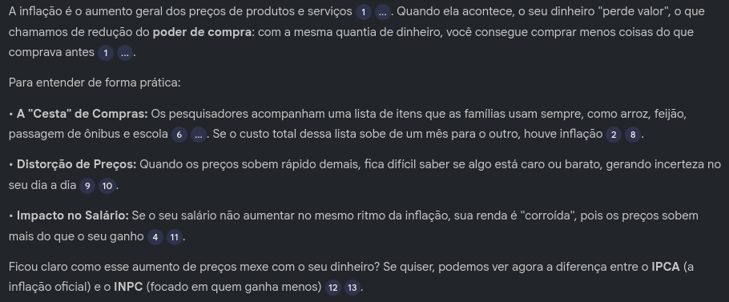
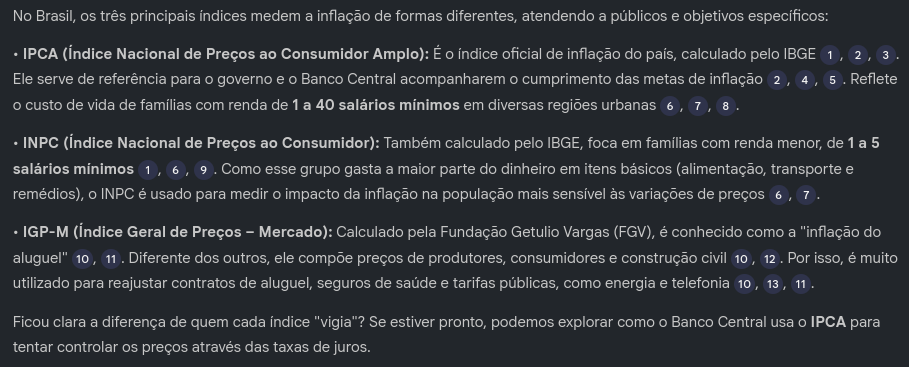
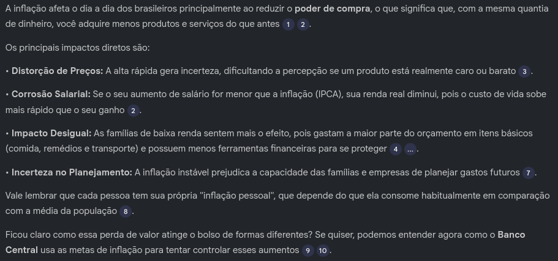
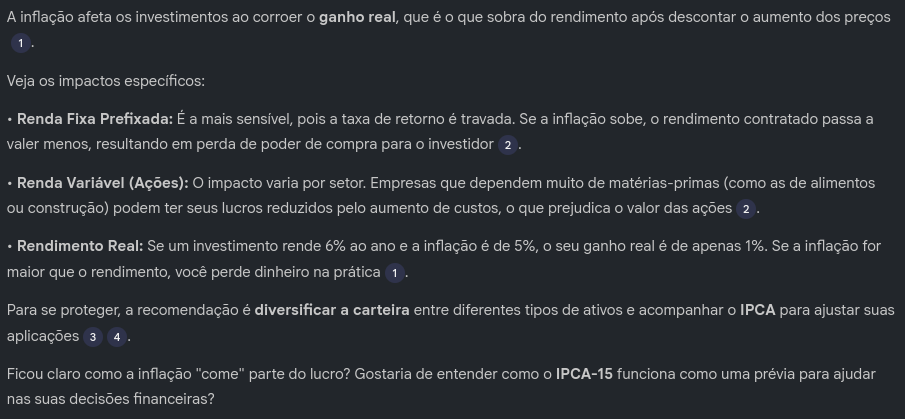
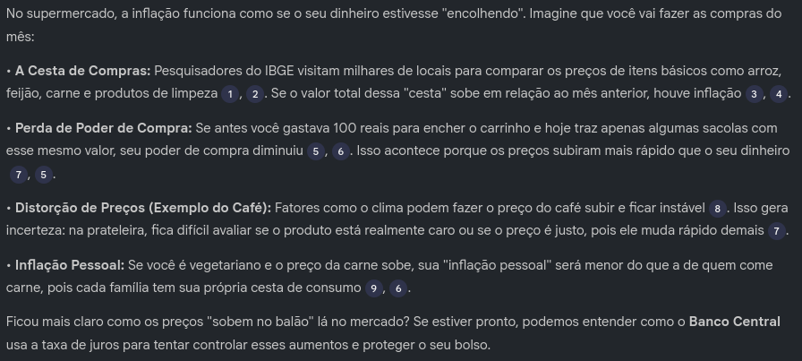

# Inflação explicada pra quem odeia economia: um miniguia

## 1. Objetivos

- Compreender os fundamentos da inflação;
- Entender os principais índices de inflação, como IPCA, INPC e IGP-M;
- Analisar como a inflação impacta os investimentos;
- Identificar como a inflação afeta o dia a dia dos brasileiros.

---

## 2. Prompts e respostas

Foram utilizados os seguintes prompts no NotebookLM:

- Explique o que é inflação de forma simples, como se eu não tivesse conhecimento em economia.
- Quais são os principais índices de inflação no Brasil (IPCA, INPC e IGP-M) e para que cada um serve?
- Como a inflação afeta o poder de compra dos brasileiros no dia a dia?
- De que forma a inflação impacta investimentos de renda fixa e renda variável?

Em todas as respostas retornadas pela IA, foi possível observar comunicação clara e referências às fontes utilizadas, evitando alucinações e garantindo maior confiabilidade das informações.

---

## 3. Testando variações de prompt

Foi escolhida a pergunta **“Explique o que é inflação de forma simples, como se eu não tivesse conhecimento em economia”** para testar variações de prompts e validar as respostas geradas, analisando também o comportamento da IA.

### Variações testadas

- **Variação 1:** Explique a inflação em linguagem informal.
- **Variação 2:** Explique a inflação usando exemplos do supermercado.
- **Variação 3:** Explique a inflação sem utilizar termos técnicos.

Após a análise, a **variação 2** apresentou o melhor resultado. O uso de exemplos práticos do dia a dia, como o aumento do preço do café, facilitou a compreensão do conteúdo e tornou a explicação mais acessível. Além disso, a resposta foi clara, curta e didática, características ideais para um miniguia.

Nas variações 1 e 3, observou-se repetição excessiva de palavras e exemplos, além de menor diferenciação entre as abordagens. Faltou uma exploração mais criativa e específica em cada variação para gerar exemplos realmente distintos.

A resposta da variação 2 foi selecionada como referência para este estudo.

---

## 4. Glossário relacionado à inflação  
*(com base nas fontes adicionadas ao NotebookLM)*

- Inflação  
- Poder de compra  
- Cesta de consumo  
- IPCA  
- INPC  
- IGP-M  
- Ganho real  
- Meta de inflação  
- IPCA-15  

---

📌 **[Acesse o projeto no LM clicando aqui!](https://notebooklm.google.com/notebook/fff7bd85-3a47-4ad5-bb60-97654d84be4e)**
